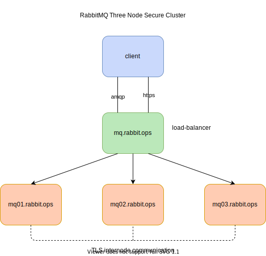

# RabbitMQ Compose Cluster

Simple RabbitMQ cluster using docker-compose with config file peer discovery.

## Architecture

Compose file creates a cluster with following architecture. Currently cluster only container three RabbitMQ nodes.

## Starting Cluster

Start the compose stack with `docker-compose up -d`.

Server `mq01.rabbit.ops` is the primary server when starting. Other servers wait for the mq01 server to complete the start.
RabbitMQ waits random time before joining the cluster with other nodes. However this method is not reliable. So `wait-for.sh` is used to pause other server
startup until primary server start and healthy.

## Management Web

Access the management ui with https://127.0.0.1:15671/ using the username and password configured in rabbitmq.conf file.

## Environment Variables

RabbitMQ server
- `RABBITMQ_ERLANG_COOKIE` Set the cookie for cluster formation. All nodes in the cluster must have same cookie value
- `RABBITMQ_NODE_NAME` Set the node name. This is used when communicating with other nodes
- `RABBITMQ_USE_LONGNAME` Cluster is setup with FQDN and requires setting to true

Wait-for script
- `PRIMARY_SERVER_HOST` Hostname of the primary server. Default is mq01.rabbit.ops
- `PRIMARY_SERVER_PORT` API port for the primary server. Default is 15672
- `PRIMARY_SERVER_USER` Admin user for the primary API server. Defaul is admin
- `PRIMARY_SERVER_PASSWORD` Admin user password for primary API server. Defaul is rabbit

## TLS Certificates

In order to make the solution more realistic, TLS certificates are created to emulate a real scenario. All certificates are issued by intermediate-CA and
intermediate-CA certificate signed by a root-CA. This requires the TLS configuration depth to be configured as 3. Both root-CA and intermediate-CA provate
key also included in the repository.

## Inter-node TLS Communication

Cluster nodes communication encrypted with TLS certificates. Environment configuration file `rabbitmq-env.conf` contains additional configuration to enable
inter-node tls communication. Configuration file `inter_node_tls.config` specify the TLS certificates for server and client. It is very important that hostname
match CN of the server certificates. Also it is very important to configure correct depth for certificate verification. In this example depth=3 as chain has
root CA, intermediate CA and server certificate.

## Management/API TLS

RabbitMQ management portal is exposed over 15671 port with a TLS certificate. This is load-balanced service endpoint via Nginx.

## TODO
- Python client for additional management
- Unit tests for cluster
